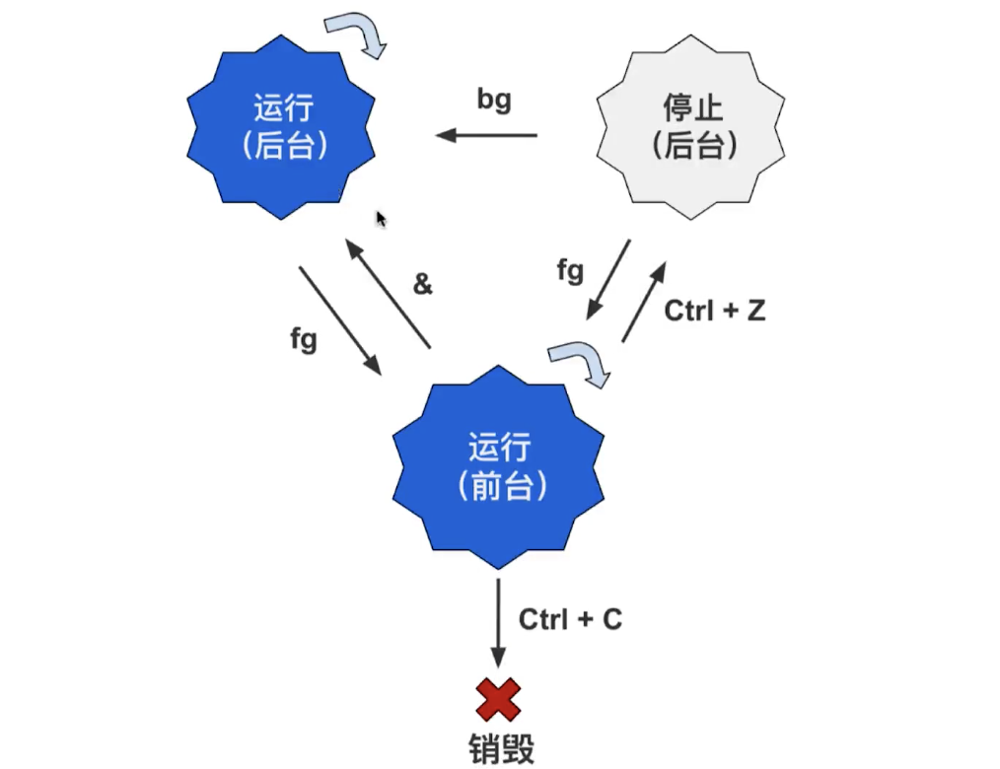

# 5种常见的进程状态

## 运行
正在运行 或 在运行队列中等待 状态码R 

## 中断
在休眠中 受阻了 状态码S 表示中断 sleeping
当某个条件形成后 或 接收到信号时 则脱离该状态

## 不可中断
进程不响应系统异步信号 状态码D uninterruptible sleep
即使用kill命令也不能使其中断

## 僵死
进程已终止 但进程描述符依然存在 直到父进程调用wait4()系统函数后将进程释放
状态码Z

## 停止
进程收到sigstop sigstp sigtin sigtou 等停止信号后
状态码T

# 进程状态图转换
